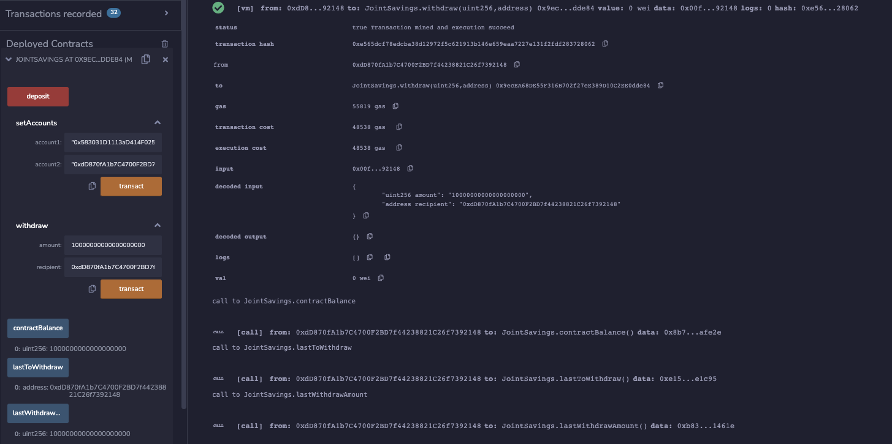

# Solidity-joint-savings
The remix IDE was used to create a simple smart contract in solidity for the purpose of emulating the functionality of a joint account. The contract was deployed on the Ethereum virtual machine (london). The contract has functions for adding a pair of accounts, depositing to the shared ethereum address and withdrawls to each of the individual owners addresses.

---

